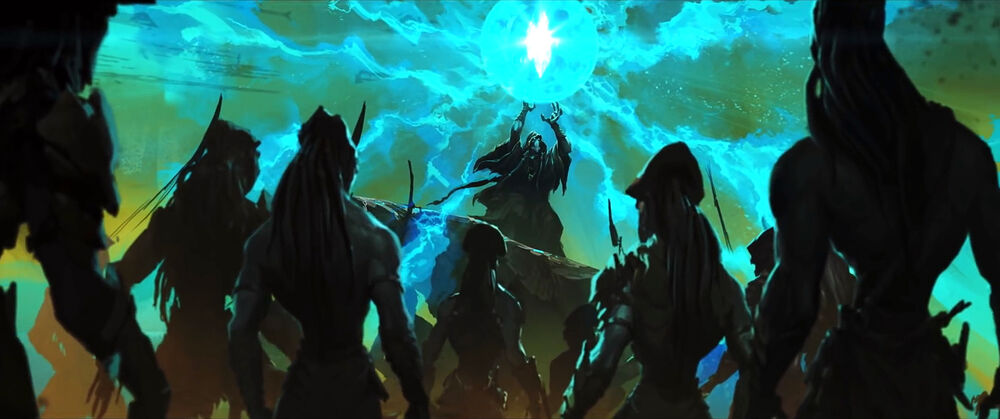

.. RayLink documentation master file, created by
sphinx-quickstart on Tue Sep  1 17:50:00 2020.
You can adapt this file completely to your liking, but it should at least
contain the root `toctree` directive.

RayLink, the sacred union of every thought & emotion
=====================================================

.. include:: tutorials/walkthrough.rst
.. include:: tutorials/demo.rst
.. include:: api.rst

.. toctree::
   :hidden:
   :maxdepth: -1
   :caption: Tutorial

   tutorials/walkthrough.rst
   tutorials/demo.rst

.. toctree::
   :hidden:
   :maxdepth: -1
   :caption: API

   api.rst

.. toctree::
   :hidden:
   :maxdepth: -1
   :caption: What's new?

   release.rst